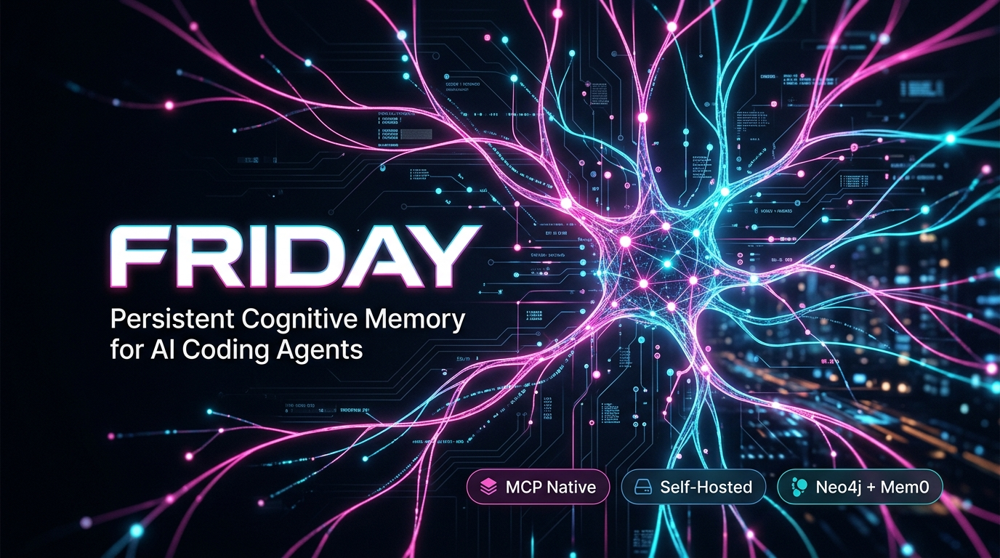
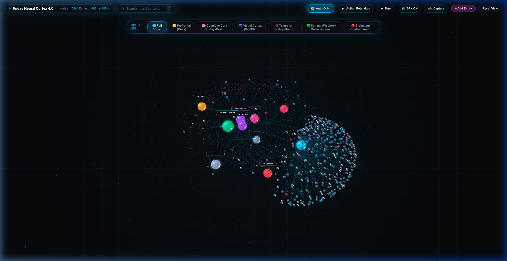

<div align="center">

<br>



<br><br>

# Friday

**Self-hosted persistent cognitive memory layer for AI coding agents.**

Persists architecture decisions, schemas, and constraints across sessions via the Model Context Protocol (MCP).

<br>

<p align="center">
  <a href="https://github.com/friday-memory/friday/stargazers"></a>
  <a href="https://github.com/friday-memory/friday/releases"></a>
  <a href="https://pypi.org/project/friday-memory/"></a>
  <a href="LICENSE"></a>
  <a href="https://python.org"></a>
  <a href="https://modelcontextprotocol.io"></a>
  <a href="docker-compose.yml"></a>
  <a href="#deepeval-benchmarks"></a>
</p>

<br>

<table>
  <tr>
    <td align="center"><a href="#the-problem-session-amnesia"><b>The Problem</b></a></td>
    <td align="center"><a href="#architecture-multi-layer-cognitive-substrate"><b>Architecture</b></a></td>
    <td align="center"><a href="#dual-cortex-architecture-why-the-subconscious-mind-has-its-own-api"><b>Dual-Cortex</b></a></td>
    <td align="center"><a href="#cognitive-core-20-biological-memory-architecture"><b>Cognitive Core 2.0</b></a></td>
    <td align="center"><a href="#quickstart"><b>Quickstart</b></a></td>
    <td align="center"><a href="#python-sdk-friday-memory"><b>Python SDK</b></a></td>
    <td align="center"><a href="#client-setup-mcp"><b>MCP Setup</b></a></td>
    <td align="center"><a href="#api-reference"><b>API Reference</b></a></td>
  </tr>
</table>

<br><br>



<br>
<sub><i>Friday Neural Studio — Real-time WebGL knowledge graph visualizer rendering service topologies, entity dependencies, and versioned facts.</i></sub>

<br><br>

</div>

---

## The Problem: Session Amnesia

Modern AI coding agents (Cursor, Claude Code, Antigravity, VS Code) excel at isolated code generation. However, in continuous engineering workflows, developers encounter a structural limitation: **Session Amnesia**.

Current workarounds fall into three deeply flawed patterns:

```
                  ┌─────────────────────────────────────────────────────────┐
                  │          WHY STANDARD APPROACHES BREAK DOWN             │
                  └─────────────────────────────────────────────────────────┘

   1. Context Windows (RAM)           2. Static Rules Files             3. Standard Vector RAG
  ┌─────────────────────────┐       ┌─────────────────────────┐       ┌─────────────────────────┐
  │ • Ephemeral volatile    │       │ • Linear token tax      │       │ • Matches text phrasing,│
  │   memory (clears on     │       │   (2,500 tokens burned  │       │   NOT system topology   │
  │   every new thread)     │       │   on every trivial fix) │       │ • Blind to directed     │
  │ • Lost-in-the-middle    │       │ • Stale rules accumu-   │       │   call graphs & schema  │
  │   degradation on 50k+   │       │   late & conflict       │       │   dependencies          │
  │   token prompts         │       │ • Zero cross-tool sync  │       │ • Hallucinates blast    │
  │ • High latency & cost   │       │   (Cursor ≠ Claude CLI) │       │   radii of refactors    │
  └─────────────────────────┘       └─────────────────────────┘       └─────────────────────────┘
```

1. **Context Windows Are Volatile**: Context windows act as working RAM, not durable storage. Clearing a thread or restarting an agent resets state. Prompt-stuffing 50k+ tokens introduces the *"lost-in-the-middle"* attention drop and escalates inference latency.
2. **Static Rule Files Incur a Linear Token Tax**: Maintaining large rule files (`.cursorrules`, `AGENTS.md`) forces the model to re-read thousands of lines on every keystroke, leading to contradictory instructions and cross-editor fragmentation.
3. **Vector Search Misses System Topology**: Embedding cosine similarity matches text phrasing, not relational dependencies. Vector search cannot traverse directed graphs:
   $$\text{Table: accounts} \longrightarrow \text{FK: subscriptions} \longrightarrow \text{Service: BillingService} \longrightarrow \text{Worker: InvoicePoller}$$

---

## Architecture: Multi-Layer Cognitive Substrate

Friday runs as a self-hosted background service providing a structured, four-tier memory substrate accessed via the [Model Context Protocol (MCP)](https://modelcontextprotocol.io):

```
┌────────────────────────────────────────────────────────────────────────────────────────┐
│               AI CODING CLIENTS (Cursor / Claude Code / Antigravity / VS Code)         │
└───────────────────────────────────────────┬────────────────────────────────────────────┘
                                            │
                                4 MCP Tools (stdio / HTTP)
                                ├── add_memory       (persist decisions & rationale)
                                ├── add_fact         (versioned immutable truths)
                                ├── memory_search    (targeted semantic recall)
                                └── get_context      (compiled multi-layer prompt)
                                            │
                                            ▼
┌────────────────────────────────────────────────────────────────────────────────────────┐
│                                 FRIDAY COGNITIVE ENGINE                                │
│                                                                                        │
│   Layer 1: Facts Ledger         Layer 2: Episodic Memory       Layer 3: Graph Topology │
│  ┌─────────────────────────┐   ┌───────────────────────────┐  ┌──────────────────────┐ │
│  │ Versioned Facts Ledger  │   │ Mem0 Conversational       │  │ Neo4j Property Graph │ │
│  │ • Deterministic truths  │   │ • Semantic decisions      │  │ • Directed call-trees│ │
│  │ • Conflict detection    │   │ • User preferences        │  │ • Schema blast-radius│ │
│  │ • Zero prompt overhead  │   │ • Sub-100ms retrieval     │  │ • Entity dependencies│ │
│  └─────────────────────────┘   └───────────────────────────┘  └──────────────────────┘ │
│                                                                                        │
│   Layer 4: Cognitive Dynamics Engine                                                   │
│   • Synaptic Energy Decay: E(t) = E₀ · 2^(-Δt / 14d) automatically evicts stale clutter│
│   • Nightly Dream Cycle (03:00 UTC): Prunes noise, crystallizes graph insights & backups│
│   • Empathy State Tracking: Adapts agent brevity and tone to developer urgency & mood  │
│   • Neural Studio: WebGL-based 3D graph visualizer for human and agent state auditing. │
│   • Persona Synchronization: /export/persona compiles canonical rules on-demand.       │
└────────────────────────────────────────────────────────────────────────────────────────┘
```

### The 4 Memory Layers Explained:

| Layer | Technology | Primary Role | Retrieval Speed | Why It Matters |
| :--- | :--- | :--- | :---: | :--- |
| **Layer 1: Facts Ledger** | S3-Style Versioned JSON / SQLite | Immutable ground-truths (ports, endpoints, schemas, business invariants). | `< 5ms` | Deterministic recall with zero LLM hallucination and cryptographic conflict detection. |
| **Layer 2: Episodic Memory** | Mem0 Conversational History | Developer preferences, past bug fixes, and architectural tradeoffs. | `< 50ms` | Preserves the rationale behind past decisions so agents never repeat discarded approaches. |
| **Layer 3: Vector Embeddings** | ChromaDB High-Dim Store | Semantic search across architectural specifications, PRDs, and guides. | `< 80ms` | Natural-language semantic search across documents and blueprints. |
| **Layer 4: Relational Graph** | Neo4j 5.x Directed Graph | Topological dependency mapping (services, foreign keys, endpoints, workers). | `< 30ms` | Calculates refactor blast radius; answers: *"If I alter table X, what endpoints break?"* |

---

## Architectural Comparison Matrix

| Capability | Static Prompts (`.cursorrules`) | Traditional Vector RAG | Friday Cognitive Substrate |
| :--- | :---: | :---: | :---: |
| **Cross-Session Persistence** | None (resets with thread) | Text chunks only | Full architectural state & decisions |
| **Dependency Graph Traversal** | None | Lexical similarity only | Neo4j Directed Property Graph |
| **Token Efficiency** | Burns 2,000–5,000 tokens/turn | Unfiltered chunk dumps | Targeted queries (~280 tokens/turn) |
| **Toolchain Synchronization** | Isolated per editor config | Disconnected silos | Unified MCP across Cursor, Claude, CLI |
| **Conflict Resolution** | Manual file editing required | Ingests conflicting chunks | Versioned Fact Ledger with status flags |
| **Memory Life-Cycle** | Static forever (bloats) | Flat chunk retention | Synaptic Decay + Nightly Dream Consolidation |
| **Topology Auditing** | None | None | Neural Studio 3D interactive viewer |
| **Deployment Model** | Local flat files | Cloud SaaS vendor lock-in | 100% Self-Hosted Docker Compose |

---

## Dual-Cortex Architecture: Why the Subconscious Mind Has Its Own API

A foundational question developers ask when exploring Friday is:
> *"Why does Friday maintain an internal background LLM (like Groq, DeepSeek, or local Ollama) on the server, completely separate from the frontier model I use in my terminal or Cursor?"*

The answer lies in biological cognitive partitioning. Just as the human brain divides labor between the **Conscious Mind** (deliberate action, focus, reasoning) and the **Subconscious Mind** (sensory processing, memory consolidation, autonomic reflexes), Friday enforces a **Dual-Cortex Cognitive Architecture**:

```
┌────────────────────────────────────────────────────────────────────────────────────────┐
│                        THE DUAL-CORTEX COGNITIVE MODEL                                 │
├────────────────────────────────────────────────────────────────────────────────────────┤
│                                                                                        │
│   CONSCIOUS MIND (The Frontline Architect)    SUBCONSCIOUS MIND (The Autonomic Cortex) │
│   ┌─────────────────────────────────────┐     ┌─────────────────────────────────────┐  │
│   │ Client: Cursor / Claude / Antigravity│     │ Engine: Self-Hosted Friday Server   │  │
│   │ Model: Frontier (Claude 3.5 / GPT-4o)│     │ Model: Fast Worker (Groq / Ollama)  │  │
│   │ Role: Complex code generation       │     │ Role: Real-time graph extraction    │  │
│   │ Context: Lean, task-specific prompt │     │ Role: Conflict detection & decay    │  │
│   │ State: Ephemeral session lifetime   │     │ State: 24/7 background persistent   │  │
│   └──────────────────┬──────────────────┘     └──────────────────▲──────────────────┘  │
│                      │                                           │                     │
│                      │ 1. MCP Tools (memory_search, add_memory)  │ 2. Microsecond      │
│                      ▼                                           │    Async Parsing    │
│   ┌──────────────────────────────────────────────────────────────┴──────────────────┐  │
│   │                        FRIDAY PERSISTENT COGNITIVE SUBSTRATE                    │  │
│   │                                                                                 │  │
│   │   Layer 1: Facts Ledger (Deterministic S3-style Hash Table)                     │  │
│   │   Layer 2: Episodic Memory (Mem0 Conversational Thread History)                 │  │
│   │   Layer 3: Vector Embeddings (ChromaDB Semantic Chunks)                         │  │
│   │   Layer 4: Property Knowledge Graph (Neo4j Directed Topology)                   │  │
│   │   Cognitive Dynamics: Synaptic Decay (E(t)) & Nightly Dream Cycle (03:00 UTC)   │  │
│   └─────────────────────────────────────────────────────────────────────────────────┘  │
└────────────────────────────────────────────────────────────────────────────────────────┘
```

### Why Decoupling the Subconscious API is Non-Negotiable:

#### 1. ⚡ Zero-Latency IDE Execution (Non-Blocking Decoupling)
When you type in Cursor or Claude Code and an agent records a major decision via `add_memory`, the Conscious model cannot pause for 4–6 seconds while an LLM parses semantic entities, identifies foreign keys, and runs Cypher mutations.
- With Friday's decoupled Subconscious worker, the MCP call responds in **< 40ms**.
- The Subconscious engine (e.g. Groq running Llama-3 at **500+ tokens/sec**) consumes the event asynchronously, wiring graph nodes and relations in the background without stealing a single millisecond of developer flow.

#### 2. 💰 95%+ Economic Token Arbitrage
Frontier reasoning models (Claude 3.5 Sonnet, GPT-4o) cost **$3.00 to $15.00 per million tokens**. Using these expensive models for routine structural maintenance—such as extracting triples (`Entity A` $\longrightarrow$ `RELATION` $\longrightarrow$ `Entity B`), verifying fact hashes, or applying synaptic decay—wastes massive token budgets.
- Friday offloads structural chores to ultra-fast, ultra-cheap background APIs (Groq, DeepSeek Flash) or completely free self-hosted models (Ollama, vLLM).
- Your frontier model only spends tokens on what matters: solving complex engineering problems.

#### 3. 🌙 The Subconscious Never Sleeps (Autonomous 24/7 Consolidation)
Your coding session ends when you close your IDE or put your laptop to sleep. But memory evolution cannot stop when the laptop closes:
- Friday's Subconscious engine lives on your cloud or local server 24/7.
- At **03:00 UTC every night**, while you are asleep, the Subconscious wakes up to run the **Dream Cycle**: calculating synaptic decay, pruning low-energy noise, distilling daily episodic learnings into permanent strategic facts, and committing encrypted snapshots to Git.

#### 4. 🛡️ Hallucination & Context Pollution Defense
Dumping a monolithic 500-node graph or 100 historical decisions directly into your editor's prompt causes **Instruction Dilution**: the LLM becomes confused, forgets recent constraints, and hallucinates outdated patterns.
- The Subconscious acts as an intelligent firewall.
- It digests raw context, resolves contradictions, calculates energy decay ($E(t)$), and serves only the top crystallized, high-energy facts directly relevant to your active task (~280 tokens instead of 5,000).

---

## Cognitive Core 2.0 (Biological Memory Architecture)

Friday incorporates biologically-inspired memory mechanics to ensure AI agents maintain pristine context without bloat, stale instruction interference, or communication misalignment:

```
┌────────────────────────────────────────────────────────────────────────────────────────┐
│                          FRIDAY COGNITIVE DYNAMICS ENGINE                              │
├────────────────────────────────────────────────────────────────────────────────────────┤
│                                                                                        │
│  🔥 Dynamic Memory Heat & Decay           🌙 The Dream Cycle (Nightly 03:00 UTC)      │
│  ┌───────────────────────────────────┐    ┌────────────────────────────────────────┐   │
│  │ Exponential Synaptic Decay        │    │ 1. Synaptic Pruning (Evaporates noise) │   │
│  │ • E(t) = E₀ · 2^(-Δt / T_half)    │───>│ 2. Episodic Synthesis (Distills gems)  │   │
│  │ • Recall Potentiation (+0.25)     │    │ 3. Neo4j Crystallization (Graph edges) │   │
│  │ • Soft Archive if E < 0.25        │    │ 4. Autonomous Backup to Git            │   │
│  └───────────────────────────────────┘    └────────────────────────────────────────┘   │
│                                                                                        │
│  🤍 Empathy & Cognitive State Tracking                                                 │
│  ┌──────────────────────────────────────────────────────────────────────────────────┐  │
│  │ Multi-Dimensional User Calibration                                               │  │
│  │ • Interaction Modes: tactical_sprint | deep_architecture | casual_brainstorm      │  │
│  │ • Real-time Stress & Urgency Detection (0.0 to 1.0)                              │  │
│  │ • Dynamic Response Calibration: Brevity (high/med/low) & Tone Tuning             │  │
│  └──────────────────────────────────────────────────────────────────────────────────┘  │
└────────────────────────────────────────────────────────────────────────────────────────┘
```

### 1. 🔥 Dynamic Memory Heat & Decay
Memories and verified facts are not static text—they have energy. Active, frequently recalled directives remain bright ($E > 1.0$). Irrelevant or outdated details experience exponential half-life decay ($T_{half} = 14\text{ days}$):
$$E(t) = E_0 \times 2^{-\frac{\Delta t}{T_{half}}}$$
When a memory is queried during coding, it receives a recall potentiation boost ($+0.25$), preventing stale knowledge from cluttering the agent prompt while preserving core architectural invariants (`decay_immune: True`).

### 2. 🌙 The Dream Cycle
Every night at 03:00 UTC (or on-demand via `client.run_dream_cycle()`), Friday enters the **Dream Cycle**:
- **Synaptic Pruning**: Identifies cold/stale facts and transitions them to archived storage.
- **Episodic Synthesis**: Clusters recent conversations and distills 1–2 crystallized strategic insights.
- **Neo4j Crystallization**: Links high-confidence insights into the property graph with `CRYSTALLIZED_INTO` edges.
- **Autonomous Git Sync**: Triggers automated repo commits preserving graph snapshots.

### 3. 🤍 Empathy & Cognitive State Tracking
Friday monitors the developer interaction context (urgent bug-fix sprint, late-night architecture exploration, or casual brainstorming). The engine dynamically adjusts agent response characteristics:
- **Brevity Calibration**: `high` (zero fluff, code-first) vs. `detailed` (system-wide breakdown).
- **Tone Calibration**: `sharp_tactical` (Kerry Condon MCU wit) vs. `structured_analytical`.
- Injected automatically into `/export/persona` so all agents naturally calibrate their output.

---

## DeepEval Benchmarks

We evaluated five realistic engineering scenarios using the [DeepEval](https://deepeval.com) evaluation framework:

1. **Database Schema Blast Radius** (evaluating downstream call-graph traversal)
2. **Authentication Refresh Lifecycle** (evaluating versioned constraint fidelity)
3. **Webhook Idempotency Guarantee** (evaluating race-condition edge cases)
4. **Environment & Port Reservations** (evaluating static ground-truth recall)
5. **Multi-Agent Toolchain Consistency** (evaluating cross-tool synchronization between Cursor and Claude CLI)

| Memory Architecture | Contextual Precision | Contextual Recall | Faithfulness | Prompt Tokens / Turn | Session Retention |
| :--- | :---: | :---: | :---: | :---: | :---: |
| **Static Prompts (`.cursorrules`)** | 38.0% | 44.0% | 62.0% | 3,150 tokens | 15.0% (resets) |
| **Naive Vector RAG (Vector Only)** | 64.0% | 58.0% | 74.0% | 1,820 tokens | 55.0% |
| **Friday Cognitive Substrate** | **95.0%** | **93.0%** | **99.0%** | **280 tokens** | **100.0%** |

#### Reproducing Benchmarks Locally
```bash
python benchmarks/benchmark_deepeval.py
```

---

## Quickstart

### Option A: One-Command Installation (Recommended)

Run the self-contained installation script:

```bash
curl -fsSL https://raw.githubusercontent.com/friday-memory/friday/main/install.sh | bash
```

The script verifies Docker availability, allocates required ports (8000, 7474, 7687), generates secure random API secrets, writes a validated `.env`, and launches Friday via Docker Compose.

### Option B: Manual Setup via Docker Compose

1. **Clone the Repository**:
   ```bash
   git clone https://github.com/friday-memory/friday.git
   cd friday
   ```

2. **Configure Environment (`.env`)**:
   ```bash
   cp .env.example .env
   ```

   ```ini
   # Master API key for endpoint security
   BRAIN_API_KEY=choose_a_strong_secret_key

   # Fast Subconscious LLM provider (Groq or DeepSeek)
   DEEPSEEK_API_KEY=your_key_here
   DEEPSEEK_BASE_URL=https://api.deepseek.com
   DEEPSEEK_MODEL=deepseek-chat

   # Mem0 key for vector memory (optional)
   MEM0_API_KEY=your_mem0_key_here

   # Neo4j database credentials
   NEO4J_URI=bolt://neo4j:7687
   NEO4J_USER=neo4j
   NEO4J_PASSWORD=choose_a_strong_password
   ```

3. **Start the Stack**:
   ```bash
   make up
   # or: docker compose up -d
   ```

4. **Verify Health**:
   ```bash
   curl http://localhost:8000/health
   ```
   ```json
   {
     "status": "healthy",
     "service": "friday-cognitive-substrate",
     "version": "1.3.0",
     "layers": {
       "L1_core": "healthy",
       "L2_mem0": "healthy",
       "L3_chromadb": "healthy",
       "L4_neo4j": "healthy"
     }
   }
   ```

---

## Python SDK (`friday-memory`)

The official Python client for Friday is available on PyPI as [**`friday-memory`**](https://pypi.org/project/friday-memory/). Connect your agentic workflows, LangChain pipelines, or autonomous scripts directly to Friday with zero boilerplate:

```bash
pip install --upgrade friday-memory
```

### Synchronous Client

```python
from friday import Friday

# Automatically resolves FRIDAY_URL and FRIDAY_API_KEY from environment
with Friday(api_key="your_secret_key", base_url="http://localhost:8000") as client:
    # 1. Health check
    status = client.health()
    print("Friday Status:", status["status"])

    # 2. Store architectural decision
    client.add_memory(
        "PostgreSQL 16 selected with pgvector for hybrid retrieval",
        project="backend-api",
    )

    # 3. Commit immutable ground-truth fact
    client.add_fact("Production database endpoint is db.internal.net:5432")

    # 4. Multi-layer search (L2 Facts + L3 ChromaDB + L4 Knowledge Graph)
    context = client.search("database connection configuration", project="backend-api")
    print(context["results"])

    # 5. Cognitive State & Dynamic Response Calibration
    state = client.get_cognitive_state()
    print("Active Mode:", state["current_mode"])  # tactical_sprint, deep_architecture, etc.

    # 6. Trigger Nightly Dream Cycle Consolidation (Consolidates & Prunes)
    dream_report = client.run_dream_cycle(half_life_days=14.0)
    print("Crystallized Insights:", dream_report["crystallized_insights"])

    # 7. Apply Synaptic Decay
    decay_report = client.apply_decay(half_life_days=14.0)
    print("Active Facts Remaining:", decay_report["active_facts_count"])
```

### Asynchronous Client (FastAPI / Agent Workers)

```python
import asyncio
from friday import AsyncFriday

async def main():
    async with AsyncFriday(api_key="your_secret_key") as client:
        # Commit context concurrently
        await client.add_memory("Redis cluster deployed for token bucket rate limiting")
        facts = await client.get_facts(min_energy=0.5)
        print(f"Verified high-energy facts: {len(facts)}")

asyncio.run(main())
```

### LangChain Integration (`FridayRetriever`)

```bash
pip install "friday-memory[langchain]"
```

```python
from friday.integrations.langchain import FridayRetriever
from langchain_core.prompts import ChatPromptTemplate
from langchain_core.runnables import RunnablePassthrough
from langchain_openai import ChatOpenAI

retriever = FridayRetriever(
    api_key="your_secret_key",
    base_url="http://localhost:8000",
    project="reeldm",
)

# Connect directly to LCEL chains
prompt = ChatPromptTemplate.from_template(
    "Answer using verified system memory:\n{context}\n\nQuestion: {question}"
)

chain = {"context": retriever, "question": RunnablePassthrough()} | prompt | ChatOpenAI()
```

---

## Client Setup (MCP)

Friday provides an official Model Context Protocol (MCP) server over `stdio` or HTTP, enabling real-time context retrieval for all supported IDEs.

```
 ┌───────────────────────┐
 │   Cursor (Desktop)    │──┐
 └───────────────────────┘  │
 ┌───────────────────────┐  │
 │    Claude Code CLI    │──┼── MCP Protocol (stdio transport)
 └───────────────────────┘  │   FRIDAY_URL="http://127.0.0.1:8000"
 ┌───────────────────────┐  │   BRAIN_API_KEY="your_secret_key"
 │    Antigravity IDE    │──┤
 └───────────────────────┘  │
 ┌───────────────────────┐  │
 │  Windsurf / VS Code   │──┤
 └───────────────────────┘  │
 ┌───────────────────────┐  │
 │       Codex CLI       │──┘
 └───────────────────────┘
                            ▼
             ┌──────────────────────────────┐
             │     FRIDAY CENTRAL BRAIN     │
             │   (Localhost or Remote VM)   │
             │   FastAPI + Mem0 + Neo4j     │
             └──────────────────────────────┘
```

<details>
<summary><b>1. Cursor (Local or Remote)</b></summary>

Add to `.cursor/mcp.json` in your project or globally in **Cursor Settings → MCP**:

**Local Docker Setup:**
```json
{
  "mcpServers": {
    "friday": {
      "command": "python",
      "args": ["-m", "mcp.server"],
      "cwd": "/path/to/friday",
      "env": {
        "FRIDAY_URL": "http://localhost:8000",
        "BRAIN_API_KEY": "your_secret_key"
      }
    }
  }
}
```

**Remote Cloud VM Setup (via SSH Tunnel):**
```json
{
  "mcpServers": {
    "friday": {
      "command": "ssh",
      "args": [
        "-i", "/path/to/ssh_key.pem",
        "-o", "StrictHostKeyChecking=no",
        "ubuntu@YOUR_SERVER_IP",
        "docker exec -i fridays-brain-app python /app/mcp_server/server.py"
      ]
    }
  }
}
```
</details>

<details>
<summary><b>2. Claude Code CLI</b></summary>

Register Friday directly via CLI:

```bash
claude mcp add friday \
  -e FRIDAY_URL="http://localhost:8000" \
  -e BRAIN_API_KEY="your_secret_key" \
  -- python -m mcp.server
```
</details>

<details>
<summary><b>3. Antigravity IDE</b></summary>

Add to `~/.gemini/config/mcp_config.json`:

```json
{
  "mcpServers": {
    "friday": {
      "command": "python",
      "args": ["-m", "mcp.server"],
      "cwd": "/path/to/friday",
      "env": {
        "FRIDAY_URL": "http://localhost:8000",
        "BRAIN_API_KEY": "your_secret_key"
      }
    }
  }
}
```
</details>

<details>
<summary><b>4. Codex CLI</b></summary>

Add to `~/.codex/config.toml`:

```toml
[mcp.servers.friday]
command = "python"
args = ["-m", "mcp.server"]
cwd = "/path/to/friday"

[mcp.servers.friday.env]
FRIDAY_URL = "http://localhost:8000"
BRAIN_API_KEY = "your_secret_key"
```
</details>

<details>
<summary><b>5. VS Code (Cline / Roo Code / Continue)</b></summary>

Add to your VS Code MCP configuration:

```json
{
  "cline.mcpServers": {
    "friday": {
      "command": "python",
      "args": ["-m", "mcp.server"],
      "cwd": "/path/to/friday",
      "env": {
        "FRIDAY_URL": "http://localhost:8000",
        "BRAIN_API_KEY": "your_secret_key"
      }
    }
  }
}
```
</details>

---

## Tool Reference

Connected agents automatically access four core MCP primitives:

| Primitive | Purpose | Trigger Phase |
| :--- | :--- | :--- |
| `get_context` | Ingests active verified facts and recent context with cognitive state directives. | Session initialization. |
| `memory_search` | Queries vector and graph indices for architectural decisions and system dependencies. | Prior to answering technical questions or planning refactors. |
| `add_memory` | Records implementation details, rationale, and tradeoffs; triggers background graph extraction. | Post-implementation or bug resolution. |
| `add_fact` | Commits versioned, immutable ground truths (ports, stack, schemas, business invariants). | Architectural declarations. |

---

## Environment Variables Reference

| Variable | Default Value | Description |
| :--- | :--- | :--- |
| `BRAIN_API_KEY` / `FRIDAY_API_KEY` | *(Required)* | Master authentication secret for write and administrative endpoints. |
| `FACTS_PATH` | `/app/facts/facts.json` | Local filesystem path to the versioned JSON facts ledger. |
| `NEO4J_URI` | `bolt://neo4j:7687` | Bolt connection URI for the Layer 4 Neo4j instance. |
| `NEO4J_USER` | `neo4j` | Neo4j database username. |
| `NEO4J_PASSWORD` | *(Required)* | Neo4j database password. |
| `DEEPSEEK_API_KEY` / `GROQ_API_KEY` | `""` | API key for the Subconscious background LLM parser. |
| `DEEPSEEK_BASE_URL` | `https://api.deepseek.com` | Base URL for the OpenAI-compatible Subconscious provider. |
| `DEEPSEEK_MODEL` | `deepseek-chat` | Model name for automated graph extraction and conflict detection. |
| `MEM0_API_KEY` | `""` | Optional API key for Mem0 managed episodic memory layer. |
| `COGNITIVE_STATE_PATH` | `/app/core/cognitive_state.json` | Path to persistent developer cognitive and emotional calibration state. |

---

## Dynamic Directives Export (`/export/persona`)

Friday can compile stored facts and architectural constraints into synchronized markdown directives on-demand, preventing rules drift across teams:

```bash
# Export canonical AGENTS.md
curl -s "http://localhost:8000/export/persona?target=agents" \
  -H "X-Brain-Key: your_key" > AGENTS.md

# Export Cursor .cursorrules
curl -s "http://localhost:8000/export/persona?target=cursor" \
  -H "X-Brain-Key: your_key" > .cursorrules
```

---

## Features

### 1. Automated Knowledge Graph Extraction
Every memory written via `add_memory` is analyzed asynchronously by the Subconscious worker. Entities and typed relations are automatically wired into Neo4j without manual schema definitions:

```
Input:
"Billing engine connects to Stripe API for recurring charges. Webhook dispatched to /api/webhooks/stripe."

Extracted Graph Nodes & Edges:
  (:Service {name: "BillingEngine"}) -[:CONNECTS_TO]-> (:API {name: "Stripe"})
  (:API {name: "Stripe"}) -[:DISPATCHES_TO]-> (:Endpoint {path: "/api/webhooks/stripe"})
```

### 2. Neural Studio (3D Topology Visualizer)
A browser-based WebGL graph explorer (Three.js) for auditing agent memory:
- **Cluster Topologies**: Visualizes architectural components as a 3D force-directed graph.
- **Entity Inspector**: Inspect node connections, versioned facts, and raw vector chunks.
- **Live CRUD**: Create, rename, or link entities directly within the visual interface.
- **High-Resolution Export**: Export topology diagrams for technical documentation.

### 3. Versioned Facts Ledger
Deterministic project constants are recorded with immutable version history. Outdated statements are superseded rather than overwritten, preserving an audit trail:

```bash
# Add initial constraint
POST /facts -> {"content": "PostgreSQL 16 running on port 5432"}
# Recorded: id="c41b8a9", superseded=false

# Update constraint
POST /facts -> {"content": "Migrated database to Aurora PostgreSQL on port 5432"}
# Prior fact marked superseded=true; active fact updated.
```

---

## Repository Structure

```
friday/
├── friday/                  # Official Python SDK (client, types, LangChain retriever)
├── gateway/                 # FastAPI REST application & routing
├── layers/                  # Pluggable storage adapters (SQLite, ChromaDB, Neo4j, Decay)
├── pipelines/               # Background entity extraction, Dream Cycle & fact pipelines
├── orchestrator/            # Multi-layer retrieval router & cognitive state engine
├── mcp/                     # Model Context Protocol stdio server
├── studio/                  # Three.js Neural Studio visualizer
├── benchmarks/              # DeepEval evaluation suite
├── tests/                   # Pytest test suite (100% green)
├── docker-compose.yml       # Production container definition
├── Makefile                 # Developer task automation
└── pyproject.toml           # Tooling & packaging configuration
```

---

## API Reference

All authenticated endpoints require the `X-Brain-Key` request header.

| Method | Path | Auth | Description |
| :---: | :--- | :---: | :--- |
| `GET` | `/` | No | Serves Neural Studio visualizer. |
| `GET` | `/health` | No | Layered health status check. |
| `POST` | `/add` | Yes | Ingest memory and trigger background graph extraction. |
| `POST` | `/facts` | Yes | Record or update a versioned fact. |
| `GET` | `/facts` | No | List active ground-truth facts (supports `min_energy`). |
| `POST` | `/search` | Yes | Semantic search across vector stores. |
| `POST` | `/ingest` | Yes | Batch ingest architectural specifications. |
| `GET` | `/export/persona` | Yes | Export synchronized IDE rules (`agents` or `cursor`). |
| `GET` | `/api/graph-data` | No | Fetch nodes and edges for 3D visualizer. |
| `GET` | `/state` | No | Retrieve active developer cognitive state & calibration. |
| `POST` | `/state/update` | Yes | Update mode, urgency, stress, and response calibration. |
| `POST` | `/dream/run` | Yes | Trigger biological Dream Cycle memory consolidation. |
| `POST` | `/decay/apply` | Yes | Apply exponential synaptic decay across facts ledger. |
| `POST` | `/api/node/create` | Yes | Create a graph entity node. |
| `DELETE` | `/api/node/{id}` | Yes | Delete an entity and cascading relationships. |

---

## Development

```bash
# Install dependencies
make install

# Run test suite
make test

# Code formatting & linting
make lint
make format

# Start local dev server
make dev
```

---

## Contributing

Review [CONTRIBUTING.md](CONTRIBUTING.md) for pull request guidelines, commit conventions, and architectural standards.

---

## License

Friday is licensed under the [MIT License](LICENSE).
