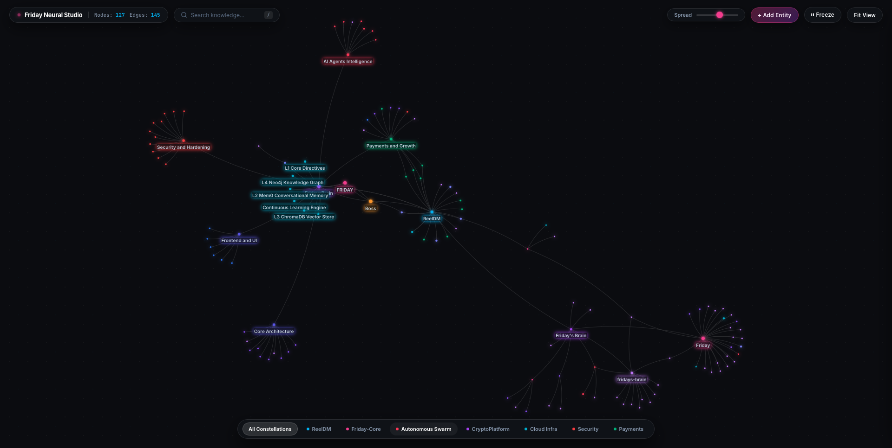

<div align="center">

<br>


<br><br>

<h1>
  
  &nbsp;Friday
</h1>

<p>
  An open-source, self-hosted <strong>persistent cognitive memory layer</strong> for AI coding agents (Cursor, Claude, VS Code).<br>
  Persists architecture decisions, schemas, and preferences across sessions via the Model Context Protocol (MCP).
</p>

<br>

<a href="LICENSE"></a>
<a href="https://python.org"></a>
<a href="https://fastapi.tiangolo.com"></a>
<a href="https://neo4j.com"></a>
<a href="docker-compose.yml"></a>
<a href="mcp/server.py"></a>
<a href="https://glama.ai/mcp/servers/itskie/friday"></a>
<a href="CONTRIBUTING.md"></a>
<a href="https://github.com/friday-memory/friday/stargazers"></a>

<br><br>

<table>
  <tr>
    <td align="center"><a href="#-60-second-quickstart"><b>🚀 Quickstart</b></a></td>
    <td align="center"><a href="#-ide-setup--10-seconds"><b>🔌 IDE Setup</b></a></td>
    <td align="center"><a href="#-features"><b>✨ Features</b></a></td>
    <td align="center"><a href="#-api-reference"><b>📡 API Docs</b></a></td>
    <td align="center"><a href="#-architecture"><b>🏗️ Architecture</b></a></td>
    <td align="center"><a href="#-roadmap"><b>🗺️ Roadmap</b></a></td>
  </tr>
</table>

<br><br>



<br>
<sub><i>Live Neural Studio — Obsidian-grade knowledge graph visualizer mapping real AI cognitive memory constellations.</i></sub>

<br><br>

</div>

---

## Why an External Cognitive Memory Layer? (The Second Brain Architecture)

Modern AI coding agents (Cursor, Claude Code, Antigravity, Copilot) are exceptionally capable at isolated code generation. However, in production engineering environments, developers repeatedly hit the same structural wall: **Session Amnesia**.

Most teams attempt to solve this with either massive prompt files (`.cursorrules`, `AGENTS.md`) or generic vector search (RAG). Both approaches break down under real-world engineering constraints:

```
                  ┌─────────────────────────────────────────────────────────┐
                  │          WHY STANDARD APPROACHES BREAK DOWN             │
                  └─────────────────────────────────────────────────────────┘

   1. Context Windows (RAM)           2. Static Rules Files             3. Vector Search (RAG)
  ┌─────────────────────────┐       ┌─────────────────────────┐       ┌─────────────────────────┐
  │ • Ephemeral volatile    │       │ • Linear token tax      │       │ • Matches text phrasing,│
  │   memory (clears on     │       │   (2,500 tokens burned  │       │   NOT system topology   │
  │   every new thread)     │       │   on every typo fix)    │       │ • Blind to directed     │
  │ • Lost-in-the-middle    │       │ • Stale rules accumu-   │       │   call graphs & schema  │
  │   degradation on 50k+   │       │   late & conflict       │       │   dependencies          │
  │   token prompts         │       │ • Zero cross-tool sync  │       │ • Hallucinates blast    │
  │ • High latency & cost   │       │   (Cursor ≠ Claude CLI) │       │   radii of refactors    │
  └─────────────────────────┘       └─────────────────────────┘       └─────────────────────────┘
```

---

### The Three Fallacies of Agent Memory

#### 1. The Context Window Fallacy (Volatile RAM vs. Storage)
Context windows are **working memory (volatile RAM)**, not storage. When you close a chat tab, trigger context compaction, or restart an agent, memory resets to zero. Furthermore, stuffing 50,000+ tokens of documentation into the prompt induces the well-documented *"lost-in-the-middle"* phenomenon: model attention degrades, subtle constraints are overlooked, and per-query latency and token bills skyrocket.

#### 2. The Linear Prompt Tax of Static Rule Files
Maintaining 600-line Markdown files (`.cursorrules`, `AGENTS.md`) introduces severe operational drag:
- **The Token Tax**: You burn 2,000–3,000 prompt tokens on *every interaction*—even when merely asking the model to fix CSS padding.
- **Knowledge Decay & Conflict**: Over months, rules rot. One section says *"use Axios"*, another says *"use fetch"*. The model receives contradictory constraints and behaves erratically.
- **Toolchain Fragmentation**: Your Cursor rules are inaccessible to your Claude Code terminal CLI, your CI pipeline bots, or your teammates. There is no Single Source of Truth.

#### 3. The Vector Search (RAG) Blindspot on Software Architecture
Vector embeddings calculate **lexical and semantic cosine similarity**, not **system topology or state**:
- *The Failure Mode*: Ask an agent: *"What breaks if I rename the `user_id` column in the `accounts` table?"*
- Standard vector search retrieves files containing the string `"user_id"`. It cannot traverse directed dependency graphs:
  $$\text{Table: accounts} \longrightarrow \text{FK: subscriptions} \longrightarrow \text{Service: BillingService} \longrightarrow \text{Worker: InvoicePoller}$$
- Software architectures are **directed graphs**, not flat text documents. Without a relational graph database, agents cannot predict the blast radius of structural changes.

---

## The Friday Cognitive Substrate

Friday runs as an independent, 24/7 self-hosted service providing a **multi-tiered cognitive architecture** accessible by all your tools via the [Model Context Protocol (MCP)](https://modelcontextprotocol.io):

```
┌────────────────────────────────────────────────────────────────────────────────────────┐
│               YOUR CODING AGENTS (Cursor / Claude Code / Antigravity / VS Code)        │
└───────────────────────────────────────────┬────────────────────────────────────────────┘
                                            │
                                4 MCP Tools (stdio / HTTP)
                                ├── add_memory       (persist decisions & rationale)
                                ├── add_fact         (versioned immutable truths)
                                ├── memory_search    (targeted semantic recall)
                                └── get_context      (compiled multi-layer prompt)
                                            │
                                            ▼
┌────────────────────────────────────────────────────────────────────────────────────────┐
│                              FRIDAY CENTRAL COGNITIVE BRAIN                            │
│                                                                                        │
│   Layer 1: Facts Ledger         Layer 2: Episodic Memory       Layer 3: Graph Topology │
│  ┌─────────────────────────┐   ┌───────────────────────────┐  ┌──────────────────────┐ │
│  │ Versioned Facts         │   │ Mem0 + ChromaDB           │  │ Neo4j Property Graph │ │
│  │                         │   │                           │  │                      │ │
│  │ • Absolute ground truth │   │ • Chronological decisions │  │ • (:Endpoint)-[:CALLS│ │
│  │ • 0 token prompt tax    │   │ • Cross-session context   │  │ • (:Service)-[:WRITES│ │
│  │ • Conflict resolution   │   │ • 90% fewer tokens        │  │ • Entity call trees  │ │
│  └─────────────────────────┘   └───────────────────────────┘  └──────────────────────┘ │
│                                                                                        │
│   ⚡ Autonomous Graph Engine: Every memory → background extraction → Neo4j graph       │
│   🎨 Neural Studio: Live interactive visualizer for human & agent cognitive auditing  │
│   🔄 Dynamic Persona Export: /export/persona endpoint feeds synchronized rules to IDEs │
└────────────────────────────────────────────────────────────────────────────────────────┘
```

---

## Architectural Comparison Matrix

| Capability | Static Prompts (`.cursorrules` / `AGENTS.md`) | Traditional RAG (Vector Only) | Friday Cognitive Substrate |
| :--- | :---: | :---: | :---: |
| **Cross-Session Persistence** | ❌ None (resets with thread) | ⚠️ Text chunks only | ✅ Full cognitive state & decisions |
| **Dependency Graph Traversal** | ❌ Zero relationship awareness | ❌ Lexical similarity only | ✅ Neo4j Directed Property Graph |
| **Token Efficiency** | ❌ Burns 2k-5k tokens per turn | ⚠️ Inefficient chunk dumps | ✅ Targeted queries (90% token savings) |
| **Multi-Agent / Multi-Tool Sync** | ❌ Isolated per editor config | ❌ Disconnected silos | ✅ Universal MCP across Cursor, Claude, CLI |
| **Knowledge Conflict Resolution**| ❌ Manual editing required | ❌ Ingests contradictory chunks | ✅ Versioned Fact Ledger with status flags |
| **Visual Architecture Audit** | ❌ None | ❌ None | ✅ Neural Studio live visualizer |
| **Deployment Model** | Local flat files | Cloud SaaS (vendor lock-in) | 100% Self-Hosted Docker Compose |

---

## 🚀 Quickstart

### Option A: One-Command Zero-Friction Setup (Recommended)

Run the automated installer in your terminal. It verifies Docker, provisions containers, generates cryptographically secure keys, and prints ready-to-use Cursor and Claude Desktop MCP configurations:

```bash
curl -fsSL https://raw.githubusercontent.com/friday-memory/friday/main/install.sh | bash
```

---

### Option B: Manual Setup via Docker Compose


> **Requirements:** [Docker](https://docker.com) + [Docker Compose](https://docs.docker.com/compose/) installed.  
> That's literally it. No Python setup. No database config. No services to manage manually.

<br>

**Clone and configure**
```bash
git clone https://github.com/friday-memory/friday.git
cd friday
cp .env.example .env
```

**Fill in your `.env`** — takes 60 seconds

```env
# Set your own master password to protect your self-hosted server
FRIDAY_API_KEY=pick_any_secret_password_you_want

# DeepSeek (ultra-affordable — $0.14/M tokens)
# Get yours at: https://platform.deepseek.com
DEEPSEEK_API_KEY=sk-xxxxxxxxxxxxxxxxxxxxxxxxxxxxxxxx

# Mem0 — generous free tier available
# Get yours at: https://mem0.ai
MEM0_API_KEY=m0-xxxxxxxxxxxxxxxxxxxxxxxxxxxxxxxx

# Neo4j password — you choose this
NEO4J_PASSWORD=change_to_something_strong
```

**Launch everything in one command**
```bash
docker compose up -d
```

This starts:
- 🧠 **Friday Brain** on `http://localhost`
- 🕸️ **Neo4j** on `http://localhost:7474`
- 🎨 **Neural Studio** at `http://localhost`

**Verify it's running**
```bash
curl http://localhost/health
# {"status":"healthy","layers":{"neo4j":"ok","mem0":"ok","facts":"ok (0 entries)"}}
```

**Store your first memory**
```bash
curl -X POST http://localhost/add \
  -H "X-Brain-Key: your_key" \
  -H "Content-Type: application/json" \
  -d '{
    "content": "We use JWT with 15min access tokens + 7-day refresh. Implementation in gateway/auth.py. Never store tokens in localStorage — httpOnly cookies only.",
    "project": "MyApp"
  }'
```

**Your AI now remembers. Forever.** ✅

---


---

## 🔄 Dynamic Persona & Directives Sync (`/export/persona`)

Instead of manually keeping `.cursorrules` or `AGENTS.md` in sync across teammates and workstations, Friday can dynamically compile your active verified facts and architectural constraints into a single markdown file:

```bash
# Pull canonical rules directly from Friday Central Brain
curl -s "http://localhost/export/persona?target=agents"   -H "X-Brain-Key: your_key" > AGENTS.md

# For Cursor .cursorrules format
curl -s "http://localhost/export/persona?target=cursor"   -H "X-Brain-Key: your_key" > .cursorrules
```

This guarantees all developers and AI agents in your organization adhere to the exact same architectural ground truths.

## 🔌 Connecting Your Agents (MCP Setup)

Friday is designed to be the **central cognitive memory for all your AI coding tools**.  
Whether Friday runs locally on your machine or on a **remote 24/7 cloud server (AWS EC2, VPS, Homelab)**, every agent connects to the **same unified memory** via the [Model Context Protocol (MCP)](https://modelcontextprotocol.io).

```
 ┌───────────────────────┐
 │   Cursor (Desktop)    │──┐
 └───────────────────────┘  │
 ┌───────────────────────┐  │
 │    Claude Code CLI    │──┼── MCP Protocol (stdio transport)
 └───────────────────────┘  │   FRIDAY_URL="http://your-server-ip:8000"
 ┌───────────────────────┐  │   BRAIN_API_KEY="your_secret_key"
 │    Antigravity IDE    │──┤
 └───────────────────────┘  │
 ┌───────────────────────┐  │
 │ Codex / Custom Agents │──┘
 └───────────────────────┘
                            ▼
             ┌──────────────────────────────┐
             │     FRIDAY CENTRAL BRAIN     │
             │   (Self-Hosted on Cloud/EC2) │
             │   FastAPI + Mem0 + Neo4j     │
             └──────────────────────────────┘
```

> 💡 **Shared Brain Superpower**: An architectural rule or decision stored by **Claude Code** in your terminal is immediately accessible to **Cursor**, **Antigravity IDE**, or **Codex** on your desktop. Zero manual syncing. One brain across your entire toolchain.

---

### Step-by-Step Client Configurations

Pick your client below, paste the configuration, and restart your agent:

<details>
<summary><b>⚡ Antigravity IDE</b></summary>

Add Friday to your Antigravity global MCP configuration at `~/.gemini/config/mcp_config.json`:

```json
{
  "mcpServers": {
    "friday": {
      "command": "python",
      "args": ["-m", "mcp.server"],
      "cwd": "/path/to/friday",
      "env": {
        "FRIDAY_URL": "http://localhost:8000",
        "BRAIN_API_KEY": "your_key_from_env"
      }
    }
  }
}
```
*(If Friday runs on a remote server/EC2, change `FRIDAY_URL` to `http://<your-server-ip>:8000`)*
</details>

<details>
<summary><b>🤖 Claude Code (CLI)</b></summary>

Connect Claude Code to your Friday brain with one terminal command:

```bash
claude mcp add friday   -e FRIDAY_URL="http://localhost:8000"   -e BRAIN_API_KEY="your_key_from_env"   -- python -m mcp.server
```

Or configure directly in `~/.claude.json` under `"mcpServers"`:

```json
{
  "mcpServers": {
    "friday": {
      "command": "python",
      "args": ["-m", "mcp.server"],
      "cwd": "/path/to/friday",
      "env": {
        "FRIDAY_URL": "http://localhost:8000",
        "BRAIN_API_KEY": "your_key_from_env"
      }
    }
  }
}
```
</details>

<details>
<summary><b>🖱️ Cursor</b></summary>

Create or edit `.cursor/mcp.json` in your project root (or add globally in **Cursor Settings → MCP → Add New Server**):

```json
{
  "mcpServers": {
    "friday": {
      "command": "python",
      "args": ["-m", "mcp.server"],
      "cwd": "/path/to/friday",
      "env": {
        "FRIDAY_URL": "http://localhost:8000",
        "BRAIN_API_KEY": "your_key_from_env"
      }
    }
  }
}
```
*(For a remote server, change `FRIDAY_URL` to `http://<your-server-ip>:8000`)*
</details>

<details>
<summary><b>📟 Codex & Autonomous Agents (CLI / Scripts)</b></summary>

Any custom agent, Codex script, or CI loop can interact with Friday in two ways:

**Option A: Via MCP stdio**
Run the MCP server directly as a subprocess using standard JSON-RPC 2.0.

**Option B: Direct HTTP REST API** (zero client dependencies)
```bash
# Store memory from any agent script
curl -X POST http://<your-server-ip>:8000/add   -H "X-Brain-Key: your_key"   -H "Content-Type: application/json"   -d '{"content": "Refactored payment gateway to Stripe SDK v2.", "project": "MyApp"}'

# Retrieve relevant context before starting a prompt
curl -X POST http://<your-server-ip>:8000/search   -H "X-Brain-Key: your_key"   -H "Content-Type: application/json"   -d '{"query": "How is payments structured?", "project": "MyApp"}'
```
</details>

<details>
<summary><b>💻 VS Code (Cline / Roo Code)</b></summary>

Add to your VS Code `settings.json` (or via Cline MCP settings):

```json
{
  "cline.mcpServers": {
    "friday": {
      "command": "python",
      "args": ["-m", "mcp.server"],
      "cwd": "/path/to/friday",
      "env": {
        "FRIDAY_URL": "http://localhost:8000",
        "BRAIN_API_KEY": "your_key_from_env"
      }
    }
  }
}
```
</details>

<details>
<summary><b>🖥️ Claude Desktop</b></summary>

Edit your Claude Desktop configuration:
- **macOS**: `~/Library/Application Support/Claude/claude_desktop_config.json`
- **Windows**: `%APPDATA%\Claude\claude_desktop_config.json`

```json
{
  "mcpServers": {
    "friday": {
      "command": "python",
      "args": ["-m", "mcp.server"],
      "cwd": "/path/to/friday",
      "env": {
        "FRIDAY_URL": "http://localhost:8000",
        "BRAIN_API_KEY": "your_key_from_env"
      }
    }
  }
}
```
</details>

<br>

> 📁 Pre-built config templates for all clients are available in [`examples/`](examples/).

---

## Features

### Auto-Graph Engine — Automated Relationship Extraction

Every memory you store is automatically analyzed by an LLM (DeepSeek Flash).  
Entities and relationships are extracted and wired into your Neo4j knowledge graph  
**without any manual input from you.**

```
Input:
"MyApp uses Stripe for subscriptions. Plans: Free ($0), Pro ($19/mo), Team ($49/mo).
 PayPal handles international. Webhooks at /api/payments/webhook."

Auto-extracted graph:
  MyApp ────USES────────▶ Stripe
  MyApp ────USES────────▶ PayPal
  MyApp ────HAS_PLAN────▶ FreePlan     [price: $0]
  MyApp ────HAS_PLAN────▶ ProPlan      [price: $19/mo]
  MyApp ────HAS_PLAN────▶ TeamPlan     [price: $49/mo]
  Stripe ───WEBHOOK_AT──▶ /api/payments/webhook
```

No YAML. No manual tagging. Just store memories, and your knowledge graph builds itself.

---

### Neural Studio — Graph Visualization UI

<br>

<p align="center">
  
</p>

A browser-based visual explorer for your AI's knowledge — built with the same graph engine  
that powers [Obsidian](https://obsidian.md)'s graph view.

**What you can do:**
- 🌌 Explore your entire knowledge base as a living constellation
- 🔍 Full-text search — camera auto-follows, inspector slides open
- 🎛️ **Spread slider** (1–10) — breathe space into dense graphs in real-time
- 🏷️ **Project filter chips** — isolate WebApp vs Auth vs Payments constellations
- 🖱️ **Click any node** → right-side inspector with facts, edges, actions
- ➕ Add / ✏️ Rename / 🗑️ Delete / 🔗 Connect — full CRUD via UI
- ❄️ **Freeze** physics to lock a layout, **Fit View** to reset camera
- ⚡ Live auto-refresh as new memories arrive

---

### Versioned Facts Ledger

Discrete facts (rules, preferences, constants) are stored with **immutable version history**.  
Old versions are superseded, never deleted. You always have a full audit trail.

```python
# Store a fact
POST /facts  →  {"content": "We deploy on Ubuntu 22.04 LTS + systemd"}
# id: "a3f9e1b2", created_at: "2026-09-01", superseded: false

# 3 months later — upgraded
POST /facts  →  {"content": "We deploy on Ubuntu 24.04 LTS + Docker Compose"}
# Old fact: superseded: true  ← preserved for history
# New fact: superseded: false ← active version

# Your AI always gets the active version. Past versions auditable via API.
GET /facts?include_superseded=true
```

---

### Semantic Search via Vector Embeddings

Instead of dumping your entire memory into every prompt, Friday uses ChromaDB vector search  
to retrieve only the **most relevant context** for each query.

```python
# Traditional RAG — expensive and noisy
context = all_memories  # 10,000 tokens of everything

# Friday — surgical precision
context = memory_search("JWT refresh token implementation")
# Returns: exactly the 3-5 memories about JWT, nothing else
# Cost: ~200 tokens vs 10,000  →  95% reduction
```

---

### Native MCP Toolset

Once connected, your AI agent automatically calls Friday's tools. No prompting required.

```
┌──────────────────────────────────────────────────────────────────┐
│  Tool            │  When Your Agent Uses It                      │
├──────────────────┼───────────────────────────────────────────────┤
│  get_context     │  At session START — loads all active facts    │
│                  │  + recent memories for instant orientation     │
├──────────────────┼───────────────────────────────────────────────┤
│  memory_search   │  Before answering architecture/design Q's     │
│                  │  "What's our auth pattern again?"              │
├──────────────────┼───────────────────────────────────────────────┤
│  add_memory      │  After implementing features, fixing bugs,    │
│                  │  making architectural decisions                │
├──────────────────┼───────────────────────────────────────────────┤
│  add_fact        │  For atomic rules that never change:          │
│                  │  stack choices, team preferences, standards   │
└──────────────────┴───────────────────────────────────────────────┘
```

**Suggested system prompt addition:**
```
At the start of every session, call get_context to load my preferences and project context.
Before answering any technical question, call memory_search with the relevant topic.
After implementing features or making decisions, call add_memory to persist the context.
```

---

## Architecture

```
friday/
│
├── 📡 gateway/
│   └── main.py              # FastAPI backbone — auth, routing, all endpoints
│
├── 🧩 layers/               # Pluggable memory backends (swap any layer)
│   ├── layer2_mem0.py       # Semantic memory — Mem0 cloud API
│   ├── layer3_chroma.py     # Vector store — ChromaDB (local)
│   └── layer4_neo4j.py      # Knowledge graph — Neo4j
│
├── ⚡ pipelines/            # Background intelligence
│   ├── auto_graph.py        # LLM entity extraction → Neo4j wiring
│   └── extract_facts.py     # S3-style versioned fact management
│
├── 🔀 orchestrator/
│   └── router.py            # Query routing — picks best layer per query type
│
├── 🔌 mcp/
│   └── server.py            # MCP stdio server (JSON-RPC 2.0)
│                            # ← This is what your IDE connects to
│
├── 🎨 studio/
│   └── index.html           # Neural Studio — 1,400 lines, zero dependencies
│                            # force-graph + d3 + vanilla JS
│
├── 🐳 docker-compose.yml    # Neo4j + Friday Brain — production-ready
├── 🐳 Dockerfile            # python:3.11-slim, multi-stage ready
├── 📦 requirements.txt      # Pinned dependencies
└── 🌱 seed/                 # Demo data to bootstrap a fresh install
    ├── facts.example.json
    └── blueprints/demo_architecture.md
```

**Data Flow:**

```
[Your IDE] 
    → MCP call: add_memory("We use Redis for rate limiting")
        → gateway/main.py  → Mem0 store (sync)
                           → auto_graph.py (background)
                               → DeepSeek: extract entities
                               → Neo4j: MERGE Redis node
                               → Neo4j: CREATE edge (:App)-[:USES]->(:Redis)
        ← {"status": "added", "mem0_id": "abc123"}
```

---

## API Reference

All authenticated endpoints require the `X-Brain-Key` header.  
🌐 = public endpoint (no auth required).

| Method | Endpoint | Auth | Description |
|:---:|:---|:---:|:---|
| `GET` | `/` 🌐 | — | Serves the Neural Studio UI |
| `GET` | `/health` 🌐 | — | Health check — reports status of all layers |
| `GET` | `/docs` 🌐 | — | Interactive Swagger UI |
| `POST` | `/add` | ✅ | Store a memory + trigger auto-graph wiring |
| `POST` | `/facts` | ✅ | Add or supersede a versioned fact |
| `GET` | `/facts` 🌐 | — | List all active facts |
| `GET` | `/facts?include_superseded=true` 🌐 | — | Full history including superseded |
| `POST` | `/search` | ✅ | Semantic search via Mem0 |
| `POST` | `/ingest` | ✅ | Ingest a document / architecture blueprint |
| `GET` | `/api/graph-data` 🌐 | — | All nodes + edges for Neural Studio |
| `GET` | `/api/search-quick?q=term` 🌐 | — | Fast fuzzy node name search |
| `POST` | `/api/node/create` | ✅ | Create entity node in graph |
| `DELETE` | `/api/node/{id}` | ✅ | Delete node + all relationships |
| `POST` | `/api/node/rename` | ✅ | Rename an entity node |
| `POST` | `/api/link/create` | ✅ | Create a typed relationship edge |

> Full interactive docs: `http://localhost/docs`

---

## Environment Variables

| Variable | Required | Default | Description |
|:---|:---:|:---|:---|
| `FRIDAY_API_KEY` | ✅ | — | Your self-hosted server secret (set by you to protect endpoints) |
| `DEEPSEEK_API_KEY` | ✅ | — | LLM key for auto-graph extraction |
| `MEM0_API_KEY` | ✅ | — | Mem0 key for semantic memory |
| `NEO4J_PASSWORD` | ✅ | — | Neo4j DB password (you set this) |
| `NEO4J_URI` | — | `bolt://neo4j:7687` | Neo4j connection string |
| `NEO4J_USER` | — | `neo4j` | Neo4j username |
| `DEEPSEEK_BASE_URL` | — | `https://api.deepseek.com` | LLM API base URL |
| `DEEPSEEK_MODEL` | — | `deepseek-chat` | LLM model name |
| `FACTS_PATH` | — | `/app/facts/facts.json` | Path for facts ledger file |
| `HOST` | — | `0.0.0.0` | Server bind address |
| `PORT` | — | `8000` | Server port |

**Where to get your keys (all have free tiers):**

| Service | Link | Cost |
|:---|:---|:---|
| **DeepSeek** | [platform.deepseek.com](https://platform.deepseek.com) | ~$0.14/M tokens — cheapest capable LLM |
| **Mem0** | [mem0.ai](https://mem0.ai) | Generous free tier |
| **Neo4j** | Bundled in Docker Compose | Free & local |

---

## Roadmap

**v1.0 — Foundation** ✅ *shipped*
- [x] FastAPI memory gateway with full REST API
- [x] Neo4j knowledge graph integration
- [x] Autonomous graph extraction engine (DeepSeek + Neo4j)
- [x] Neural Studio UI — Obsidian-grade graph browser
- [x] MCP server — Cursor / Antigravity / Claude Desktop / VS Code
- [x] S3-style versioned facts ledger
- [x] Docker Compose — 1-command self-hosted setup
- [x] ChromaDB semantic search layer
- [x] Full CRUD via Neural Studio (add / rename / delete / connect)
- [x] Per-project constellation namespacing

**v1.1 — Multi-User & DX** 🚧 *in progress*
- [ ] Multi-user support with isolated namespaces
- [ ] Python SDK (`pip install friday-client`)
- [ ] TypeScript/JavaScript SDK
- [ ] `friday` CLI — `friday add "..."`, `friday search "..."` from terminal

**v1.2 — Integrations** 📋 *planned*
- [ ] GitHub Actions bot — auto-store PR summaries as memories
- [ ] Slack integration — `/friday remember ...` from Slack
- [ ] Jira / Linear sync — auto-import tickets as project context
- [ ] VS Code extension — sidebar memory panel

**v2.0 — Cloud** 🌐 *future*
- [ ] Friday Cloud — managed, zero-infra option
- [ ] Team workspaces — shared memory across your engineering team
- [ ] Private beta waitlist

---

## Contributing

Friday is built in public and we'd love your contributions.

```bash
# Fork & clone
git clone https://github.com/YOUR_USERNAME/friday.git
cd friday

# Set up environment
cp .env.example .env
pip install -r requirements.txt

# Run tests — all must be green before PRing
python -m pytest tests/ -v
# ✅ 9 passed in 0.34s

# Create your branch
git checkout -b feat/your-amazing-feature

# Commit using conventional commits
git commit -m "feat: add X that does Y"

# Push & open PR
git push origin feat/your-amazing-feature
```

See [CONTRIBUTING.md](CONTRIBUTING.md) for full guidelines.  
Browse [`good first issue`](https://github.com/friday-memory/friday/issues?q=label%3A%22good+first+issue%22) labels to find where to start.

---

## Security

Friday is designed for self-hosted deployment. A few notes:

- **API Key auth** — all write endpoints require `X-Brain-Key` header
- **Public read** — `/health`, `/facts` (read), `/api/graph-data`, and Neural Studio are public by default. If you expose Friday publicly, consider adding reverse-proxy authentication (e.g., Nginx basic auth or Cloudflare Access).
- **Secrets** — never commit your `.env`. It's in `.gitignore` by default.
- **Network** — by default, Friday binds to `0.0.0.0`. For local-only use, change to `127.0.0.1` in `.env`.

Found a vulnerability? Please open a **private** security advisory on GitHub rather than a public issue.

---

## License

MIT © 2026 Friday Contributors — see [LICENSE](LICENSE) for details.

---

<div align="center">

<br>

**Built for the AI-native developer generation.**

<br>

If Friday saved you from AI amnesia, please consider giving it a ⭐  
It helps more developers discover the project and keeps us motivated.

<br>

[⭐ Star on GitHub](https://github.com/friday-memory/friday) &nbsp;·&nbsp;
[🐛 Report Bug](https://github.com/friday-memory/friday/issues/new?template=bug_report.md) &nbsp;·&nbsp;
[💡 Request Feature](https://github.com/friday-memory/friday/issues/new?template=feature_request.md) &nbsp;·&nbsp;
[💬 Discussions](https://github.com/friday-memory/friday/discussions)

<br>

<sub>Made with ❤️ by developers who were tired of repeating themselves to their AI.</sub>

</div>
